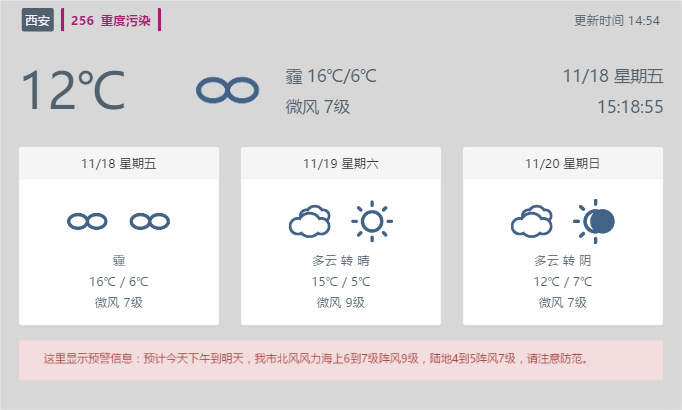

# Simple Weather Service

A simple Weather Service using NodeJS and HeWeather apis for Raspberry PI.

使用[和风天气API](http://docs.heweather.com/)，用于树莓派的天气预报服务



## 安装

安装前，需要您首先安装[Git](https://git-scm.com/)及[NodeJS](https://nodejs.org/en/)(^7.1.0)

```
git clone https://github.com/ManerFan/simple-weather-service.git
cd simple-weather-service
npm install
```

## 申请KEY

前往[和风天气](http://www.heweather.com/)，注册并申请KEY

修改 `simple-weather-service/config/index.js` 中 `key` 为上述申请的KEY
 
## 构建并运行

```
npm run build
npm start
```

## 访问

使用浏览器访问 http://localhost

## 更新周期

页面默认一分钟更新一次

修改 `simple-weather-service/public/views/config.js` 中 `period` 参数（秒），以更改页面更新周期

 > 修改此参数，需要使用`npm run build`重新编译
 
## 端口

默认80端口，可修改 `simple-weather-service/config/index.js` 中 `port` 参数
 
## 调试

修改 `simple-weather-service/webpack.config.js` 中 `NODE_ENV` 为dev，启用调试

## 所用技术


